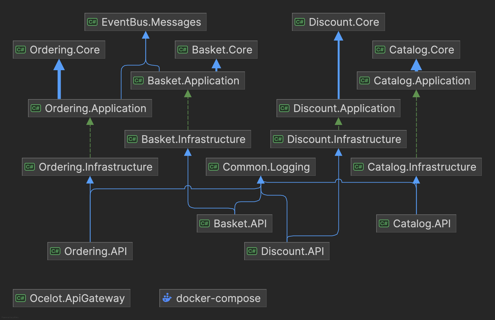
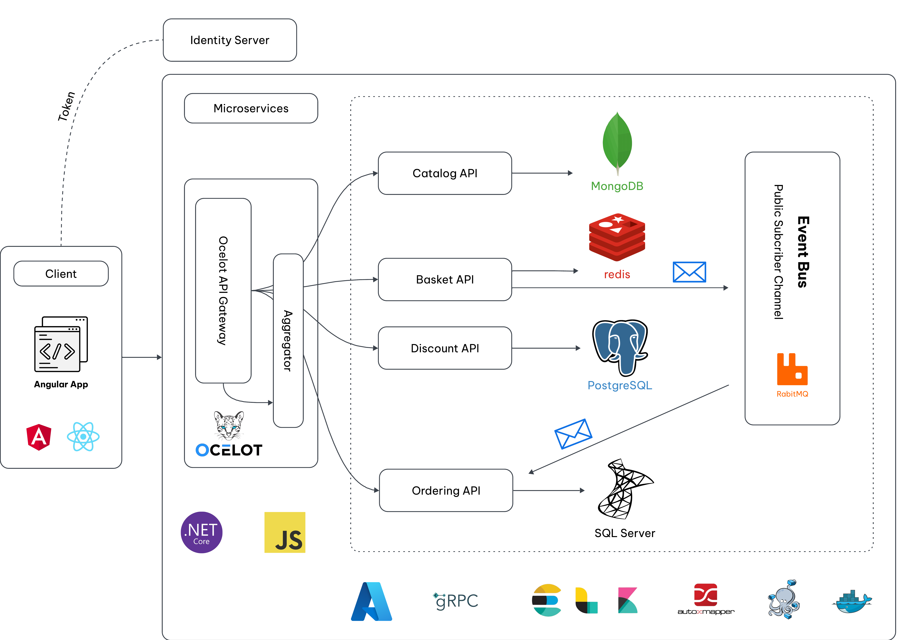

# .NET Core Microservices E-commerce Project

## Overview

A comprehensive e-commerce solution built using microservices architecture with .NET Core. This project demonstrates enterprise-level application development using modern architecture patterns, containerization, and cloud-native practices.

## Architecture Diagrams

### Dependencies Structure



The solution follows a clean layered architecture pattern with microservices:

### Services (Microservices)

Each microservice follows the same layered architecture pattern:

#### Basket Service

- **Basket.API**: REST API endpoints for basket operations
- **Basket.Application**: Application logic and business workflows
- **Basket.Core**: Domain models and business logic
- **Basket.Infrastructure**: External concerns, data access, and infrastructure

#### Catalog Service

- **Catalog.API**: REST API endpoints for product catalog
- **Catalog.Application**: Application layer business logic
- **Catalog.Core**: Core domain models and rules
- **Catalog.Infrastructure**: Data persistence and external services

#### Discount Service

- **Discount.API**: REST API for discount management
- **Discount.Application**: Discount processing logic
- **Discount.Core**: Core discount rules and models
- **Discount.Infrastructure**: Data access and external integrations

#### Ordering Service

- **Ordering.API**: Order management REST endpoints
- **Ordering.Application**: Order processing workflows
- **Ordering.Core**: Order domain models and rules
- **Ordering.Infrastructure**: Order persistence and integration

### System Architecture



The system implements:

#### Client Layer

- Angular/React-based front-end application
- Integration with Identity Server
- Communication through Ocelot API Gateway

#### API Gateway Layer

- Ocelot API Gateway for routing and aggregation
- Single entry point for all client requests

#### Microservices Layer

Each service has its own:

- REST API endpoints
- Application logic
- Domain models
- Infrastructure concerns
- Database:
  - Catalog: MongoDB
  - Basket: Redis
  - Discount: PostgreSQL
  - Ordering: SQL Server

#### Message Bus

- RabbitMQ for asynchronous communication
- Event-driven architecture between services

## Technical Stack

### Backend

- .NET Core 8.0
- Clean Architecture
- CQRS Pattern
- Entity Framework Core
- Dapper
- AutoMapper

### Databases

- MongoDB
- Redis
- PostgreSQL
- MS SQL Server

### Message Broker

- RabbitMQ

### Frontend

- Angular
- React
- TypeScript
- Material UI/Tailwind CSS

### API Gateway

- Ocelot
- JWT Authentication
- Rate Limiting
- Load Balancing

### Monitoring & Logging

- Elasticsearch
- Kibana
- Common.Logging
- Health Checks

### Containerization & Orchestration

- Docker
- Docker Compose
- Kubernetes
- Helm Charts
- Istio Service Mesh

### Development Tools

- Visual Studio 2022
- VS Code
- Git
- GitHub Actions

## Setup Instructions

### Prerequisites

- .NET Core SDK 8.0
- Docker Desktop
- Node.js (for client applications)
- Git

### Development Environment Setup

1. Clone the repository:

```bash
git clone https://github.com/yourusername/ecommerce-microservices.git
cd ecommerce-microservices
```

2. Configure Docker resources:

```bash
docker-compose -f docker-compose.yml -f docker-compose.override.yml up -d
```

Required resources:

- Memory: Minimum 7GB
- CPU: Minimum 5 cores

3. Start the services:

```bash
docker-compose up
```

## Service URLs

- Catalog API: http://localhost:8000
- Basket API: http://localhost:8001
- Discount API: http://localhost:8002
- Ordering API: http://localhost:8003
- API Gateway: http://localhost:8010
- Web Client: http://localhost:4200

## Monitoring & Infrastructure URLs

- Kibana: http://localhost:5601
- Elasticsearch: http://localhost:9200
- RabbitMQ Management: http://localhost:15672
  - Username: guest
  - Password: guest
- Portainer: http://localhost:9000
- pgAdmin: http://localhost:5050
  - Email: admin@example.com
  - Password: example@123

## Project Structure

```plaintext
├── src/
│   ├── ApiGateways/
│   │   └── Ocetlot/
│   ├── Infrastructure/
│   │   ├── EventBus/
│   │   └── Common.Logging/
│   ├── Services/
│   │   ├── Basket/
│   │   │   ├── Basket.API/
│   │   │   ├── Basket.Application/
│   │   │   ├── Basket.Core/
│   │   │   └── Basket.Infrastructure/
│   │   ├── Catalog/
│   │   │   ├── Catalog.API/
│   │   │   ├── Catalog.Application/
│   │   │   ├── Catalog.Core/
│   │   │   └── Catalog.Infrastructure/
│   │   ├── Discount/
│   │   │   ├── Discount.API/
│   │   │   ├── Discount.Application/
│   │   │   ├── Discount.Core/
│   │   │   └── Discount.Infrastructure/
│   │   └── Ordering/
│   │       ├── Ordering.API/
│   │       ├── Ordering.Application/
│   │       ├── Ordering.Core/
│   │       └── Ordering.Infrastructure/
│   └── client/
├── docker-compose.yml
├── docker-compose.override.yml
├── README.md
└── LICENSE
```

## License

This project is licensed under the MIT License - see the [LICENSE](LICENSE) file for details.
